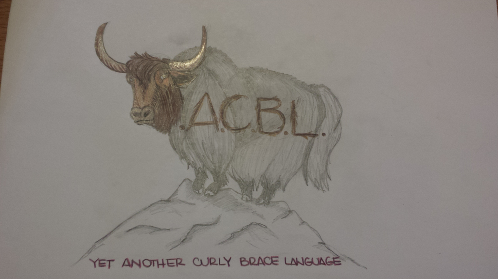

<p align="center">
  
</p>
==============
# YACBL [](https://travis-ci.org/akrs/YACBL) - Yet Another Curly Braced Language
YACBL is a statically typed language that bring the power of a scripting language to a less ambiguous static language like Java. Our goal in designing YACBL was to eliminate the ambiguity that can come with a scripting language while maintaining a smooth and flowing syntax. The compiler is written in CoffeeScript and is compiled into Java. 

==============

# Primitive Types
* bool
* int
* uint
* float
* tuple
* func

# Variable Declaration and Assignment 
```
x : int       // will be null
y := 5        // Inferred type of int
z : int = 5
a : String 
b, c : String // a and b both are Strings
```
# Functions
* Are first class variables (a primitive type actually)
* The declaration looks like:
```
function_name : func (in1 : in1_type, in2 : in2_type) -> out1_type, out2_type =
```
* foo : func () -> void // a function that takes in nothing and returns nothing.
* foo : func (x : int) -> void
* foo : func (x : int) -> uint 

# IF
```
if (x || y) {
    // code here
}
```

# Loops
* for (x in 1...100)
* for (x in 0..<y)
* for (x := 0; x < n; x++)
* for (lego in legos) // Note, collection should implement iterable for this to work.
* while (true)

# Objects
* Objects must be declared in advance of use, like in Java
* Properties are declared like normal variables, prepended by an access level.
* Access levels are:
 * public: can be read and set from anywhere
 * private: can be read and set only by methods of the object
 * protected: can only be set by methods of the object, can be read from anywhere
* Public properties can optionally be followed by a where statement.
 * This can either be a single statement, like in the example below, or a 'mini-function'
 * This statement or mini-function will be evaluated whenever the property is set from outside the object.
  * NB: This will not be run if an internal method sets the property
 * If either the mini-function or the statement returns or evaluates to false, an exception will be raised, and the property will not be set. If it returns/evaluates to true, the property will be set.
 * This allows for property access and setting without having to code getters and setters (ideally)
 * the mini function can only access properties of the object
```
Student : Obj {
    read-only id : String
    public age : uint
    public name : String where !name.equals("")

    private middle_name : String

    private something : func (other : String) -> void = {
        // Code here
    }
    
    public something_else : func (other : String) -> void = {
        // Code here
    }

}
```

## Inheritance, interfaces:
Examples:
```
Iterable : Interface {    // This defines the interface Iterable
    final public type
    next : func () -> type
    remove : func () -> void
    has_next : func () -> bool
}

Linked_List : Iterable {  // This defines the class Linked_list that implements iterable
    // Code here
    Iter : Iterator {     // This defines Linked_List.Iter that implements Iterator
        Iter : func (l : Linked_List) -> Iter {
            // Code here
        }
    }
    // Code here
}
```

# More example YACBL programs can be found [here](https://github.com/akrs/YACBL/tree/master/sample_code).