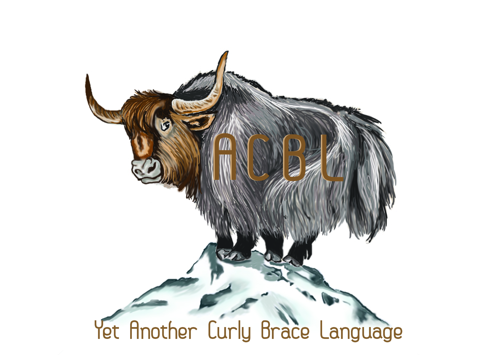

==============
# YACBL [](https://travis-ci.org/akrs/YACBL) - Yet Another Curly Braced Language
YACBL is a statically typed language that bring the syntactical sugar of a scripting language to a less ambiguous static language like Java. Our goal in designing YACBL was to eliminate the ambiguity that can come with a scripting language while maintaining a smooth and flowing syntax. The compiler is written in CoffeeScript and YACBL is compiled into Java.

==============

# Primitive Types
* bool
* int
* uint
* float
* tuple
* func

# Variable Declaration and Assignment
Want types in your source code? No problem.
```
x : int       # will be 0                      int x;
z : int = 5                                    int z = 5;
a : String                                     String a;
b, c : String # a and b both are Strings       String b, c;
```
Think types everywhere is clunky? Also no problem.
```
y := 5        # Inferred type of int           int x = 5;
hello := "Hello world!"                        String hello = "Hello world";
```
# Functions
The declaration looks like:
```
collatz : func (x : uint) -> uint =             public static int collatz (int x)
```

Multiple return values, no problem.
```
# YACBL
divmod : func (dividend : int, divisor : int) -> (int, uint)

//Java
public static int[] divmod (int dividend, int divisor)
```

Wanna pass a function in, no problem
```
twice : func (f : func (int) -> int, x : int) {        // Java left an an exercise to the reader
    return f(f(x))
}
```

# Conditional statements
If is still the same thing you know and love.
```
if (x) {                                if (x) {
    # code here                            // code here
}                                       }
```

# Loops
For loops have special syntactic sugar
```
for (x in 0 ... 100) {                    for (int i = 0; i < 100; i++) {
    # code here                            // code here
}                                       }
```
Wanna iterate over a collection?
```
for (yak in herd) {                     for (yak : Herd) {
    # do something                          // do something
}                                       }
```
While loops are the same as you already know
```
while (x < y) {                         while (x < y) {
    # code here                             // code here
}                                       }
```
# Objects
* Objects must be declared in advance of use, like in Java
* Properties are declared like normal variables, prepended by an access level.
* Access levels are:
 * public: can be read and set from anywhere
 * private: can be read and set only by methods of the object
 * protected: can only be set by methods of the object, can be read from anywhere
* Public properties can optionally be followed by a where statement with a single boolean statement
 * This statement will be evaluated whenever the property is set
 * If either the statement  evaluates to false, an exception will be raised, and the property will not be set. If it evaluates to true, the property will be set.
 * This allows for property access and setting without having to code getters and setters

```
class Student : Obj {                                               public class Student {
    protected id : String                                               private String id;
    public age : uint                                                   private int age;
    public name : String where !name.equals("")                         private String name;

    public Student : func (id : String, age : uint, name : String) -> (Student) {    public Student (String id, int age, String name) {
        # Constructor code                                                  // Constructor code
    }                                                                   }

    private something : func (other : String) -> void = {               private void something (String other) {
        # Code here                                                         // Code here
    }                                                                   }

    public something_else : func (other : String) -> void = {           public void something_else (String other) {
        # Code here                                                         // Code here
    }                                                                   }

}                                                                       public int getAge () {
                                                                            return age;
                                                                        }

                                                                        public void setAge (int newAge) {
                                                                            if (name < 0) {
                                                                                throw new IllegalArguementException("name too small");
                                                                            } else {
                                                                                this.age = newAge;
                                                                            }
                                                                        }

                                                                        // Remainder of getters and setters left as a exercise to the reader
```

## Inheritance, interfaces:
Similar to C#:
```
class Iterable : Interface {                    interface Iterable {
    next : func () -> Obj                           public Object next ();
    remove : func () -> void                        public void remove ();
    has_next : func () -> boolean                   public boolean hasNext();
}                                               }

class Linked_List : Iterable {                  public class Linked_List implements Iterable
    # Code here                                     // Code here
    class Iter : Iterator {                         private class Iter implements Iterator
        Iter : func (l : Linked_List) -> Iter {
            # Code here
        }
    }
    # Code here
}
```

# Syntaxes

Version 0.1
## Micro
```
id       ::= letter(wordchar)*
keywords ::= ['Obj'|'class'|'func'|'int'|'bool'|'float'|'uint'
             |'tuple'|'for'|'while'|'if'|'public'|'private'|'protected'
             |'void'|'null'|'main'|'in'|'true'|'false'|'return'|'Interface']
assignop ::= '+=' | '-=' | '*=' | '/=' | '%='
boolop   ::= '||' | '&&'
relop    ::= '<' | '<=' | '==' | '!=' | '>=' | '>'
bitop    ::= '|' | '&' | '^'
shiftop  ::= '<<' | '>>'
addop    ::= '+' | '-'
multop   ::= '*' | '/' | '%'
negop    ::= '-' | '!'
incdecop ::= '++' | '--'
boollit  ::= 'true' | 'false'
letter   ::= [\p{L}]
wordchar ::= [\\p{L}\\p{Nd}_]
strlit   ::= '"'['.' ^'"' '\"']'"'
intlit   ::= [\p{Nd}]
floatlit ::= [\p{Nd}]*.[\p{Nd}]+
```

## Macro
```
Program     ::= Declaration+
Declaration ::= FuncDec
             |  ClassDec
             |  PrimDec
             |  TupleDec
FuncDec     ::= id ':' 'func' '(' Params? ')' '->' (Returns | 'void') Block
Params      ::= id ':' type (',' id ':' type)*
Returns     ::= (id ':')? type (',' (id ':')? type)*
ClassDec    ::= 'class' id ':' (id | 'Obj' | 'Interface') '{' PropDec+ '}'
PrimDec     ::= id ((':=' Exp) | ':' type ('=' Exp)?)
TupleDec    ::= id (',' id)* ':' type (',' type)* ('=' Exp (',' Exp)*)?
             |  id (',' id)* ':=' Exp (',' Exp)*
PropDec     ::= ('public' | 'protected' | 'private') (FuncDec | ClassDec | (PrimDec ('where' Exp)?)) 'EOL'
Block       ::= '{' 'EOL'? Stmt* 'EOL'? '}'
Stmt        ::= Loop 'EOL'
             |  If 'EOL'
             |  Declaration 'EOL'
             |  Assign 'EOL'
             |  Exp 'EOL'
Loop        ::= (For | While) Block
For         ::= 'for' '(' id 'in' (id | Range) ')'
Range       ::= intlit ('...' | '..<') intlit
While       ::= 'while' '(' Exp ')'
If          ::= 'if' '(' Exp ')' Block
Assign      ::= id (',' id)* '=' Exp (',' Exp)*
             |  id assignop Exp
Exp         ::= Exp1 (boolop Exp1)*
Exp1        ::= Exp2 (relop Exp2)?
Exp2        ::= Exp3 (bitop Exp3)*
Exp3        ::= Exp4 (shiftop Exp4)*
Exp4        ::= Exp5 (addop Exp5)*
Exp5        ::= Exp6 (multop Exp6)*
Exp6        ::= negop? Exp7
Exp7        ::= incdecop? Exp8
Exp8        ::= Exp9 incdecop?
Exp9        ::= Exp10 ('.' Exp10)?
Exp10       ::= FuncCall | '(' Exp ')' | Literal | ArrayAccess
Literal     ::= intlit | floatlit | boollit | strlit | StrPrt
FuncCall    ::= id '(' (Exp (',' Exp)*)? ')'
ArrayAccess ::= id '[' Exp ']'
StrPrt      ::= '"'(['.' ^'"' '\"']* '$(' Exp ')' ['.' ^'"' '\"']*)+'"'
```

More example YACBL programs can be found [here](https://github.com/akrs/YACBL/tree/master/sample_code).
